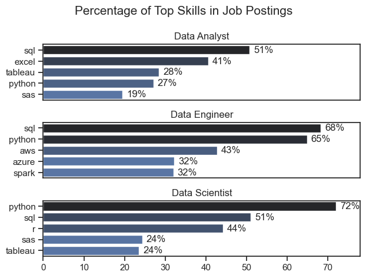
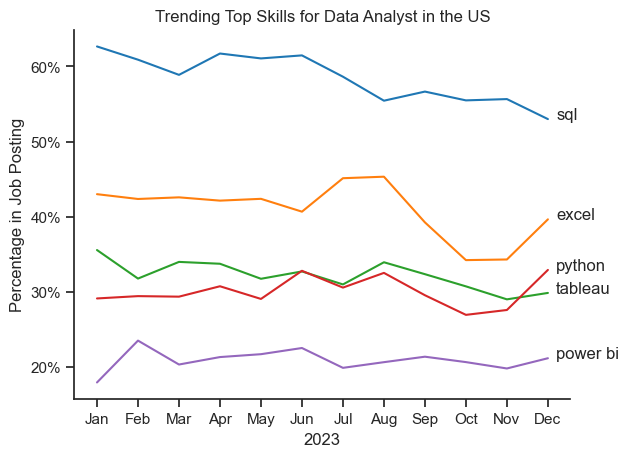

# Data Job Market Analysis: Skill Demand & Trends

This repository contains a comprehensive analysis of the data job market, examining skill requirements and employment trends across the most popular data roles. Through systematic data exploration and visualization, this project provides actionable insights for career planning in the data science field.

## Research Questions & Methodology

### 1. What are the most demanded skills for the top 3 most popular data roles?

**Objective**: Identify critical skills required across the most sought-after data positions to inform targeted skill development strategies.

**Methodology**: 
- Analyzed job posting frequency to identify the three most popular data roles
- Extracted and quantified skill mentions across these positions
- Ranked the top 5 skills for each role based on occurrence percentage

View my notebook with detailed steps here: [2_Skill_Demand](Python_Data_Project/Project/2_Skills_Counting.ipynb).

### Visualize Data

```python
fig, ax = plt.subplots(len(job_titles), 1)


for i, job_title in enumerate(job_titles):
    df_plot = df_skills_perc[df_skills_perc['job_title_short'] == job_title].head(5)[::-1]
    sns.barplot(data=df_plot, x='skill_percent', y='job_skills', ax=ax[i], hue='skill_count', palette='dark:b_r')

plt.show()
```
### Results

*Bar graph visualizing the salary for the top 3 data roles and their top 5 skills associated with each.*
#### Key Insights

**Cross-Role Skill Patterns:**
- **SQL dominance in analytics roles**: SQL appears in 51% of Data Analyst and 53% of Data Scientist positions, establishing itself as the foundational skill for data querying and manipulation across analytical roles
- **Python's versatility**: Present in 65-72% of all three roles, Python serves as the universal programming language bridging data analysis, machine learning, and data engineering workflows

**Role-Specific Specializations:**
- **Data Engineers** require infrastructure-focused skills (AWS 43%, Azure 32%, Spark 32%), reflecting their responsibility for building scalable data pipelines and cloud-based architectures
- **Data Analysts** emphasize business intelligence tools (Excel 41%, Tableau 28%), highlighting their role in creating accessible insights for business stakeholders  
- **Data Scientists** balance statistical programming (Python 72%, R 44%) with database management, supporting both model development and data exploration

**Strategic Career Implications:**
This skill distribution suggests distinct career pathways within data roles, with Data Engineering requiring deeper technical infrastructure knowledge, while Data Analysis focuses on business-oriented visualization and reporting tools.

---


### 2. How are in-demand skills trending for Data Analysts?

**Objective**: Track the evolution of skill demand throughout 2023 to identify emerging trends and shifting market priorities for Data Analysts.

**Methodology**:
- Filtered dataset for Data Analyst positions across 2023
- Aggregated skill mentions by month to track temporal patterns
- Calculated percentage representation of top 5 skills over time
- Applied trend analysis to identify seasonal variations and long-term shifts

**Analysis**: [3_Skills_Trend](Python_Data_Project/Project/3_Skills_Trend.ipynb)

### Visualize Data

```python

from matplotlib.ticker import PercentFormatter

df_plot = df_DA_US_percent.iloc[:, :5]
sns.lineplot(data=df_plot, dashes=False, legend='full', palette='tab10')

plt.gca().yaxis.set_major_formatter(PercentFormatter(decimals=0))

plt.show()

```

### Results


*Bar graph visualizing the trending top skills for data analysts in the US in 2023.*

### Insights:
- SQL remains the most consistently demanded skill throughout the year, although it shows a gradual decrease in demand.
- Excel experienced a significant increase in demand starting around September, surpassing both Python and Tableau by the end of the year.
- Both Python and Tableau show relatively stable demand throughout the year with some fluctuations but remain essential skills for data analysts. Power BI, while less demanded compared to the others, shows a slight upward trend towards the year's end.

